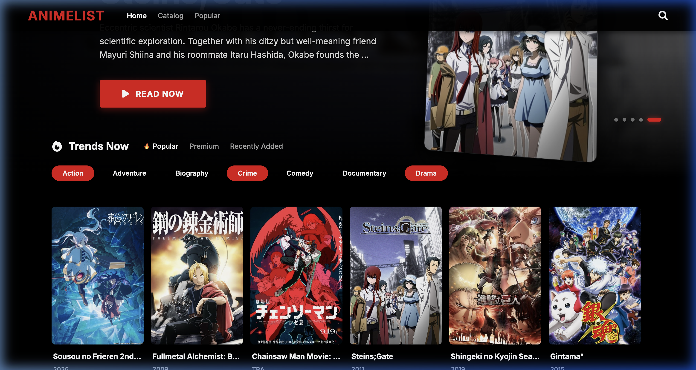
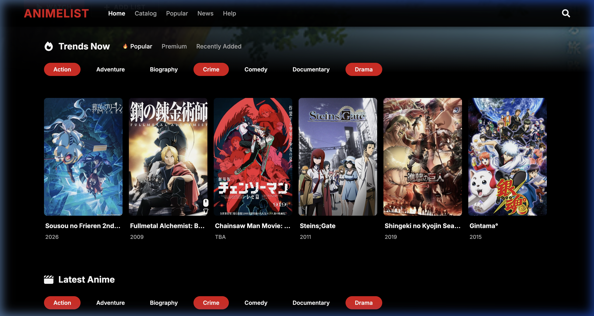
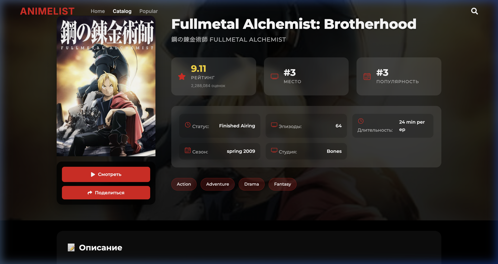

<div align="center">

# 🎬 AnimeList - Netflix Redesign

**A high-performance, modern anime discovery platform built with Next.js.**

[](https://nextjs.org/)
[](https://reactjs.org/)
[](https://www.prisma.io/)
[](https://jikan.moe/)

[Features](#-key-features) • [Tech Stack](#-tech-stack) • [Gallery](#-visual-showcase) • [Installation](#-quick-start)

---

</div>

## ✨ Key Features

- **📺 Netflix Aesthetics**: Full-bleed dark theme with signature red accents, glassmorphism headers, and smooth hover effects.
- **🔥 Dynamic Hero Carousel**: Automatically cycles through top-trending series with smooth fade transitions and interactive indicators.
- **🚀 Ultra-Fast Loading**: Optimized with **ISR (Incremental Static Regeneration)** and **SSR (Server-Side Rendering)** for instant page hits.
- **🖱️ Horizontal Scrolling**: Mouse-drag and touchpad compatible rows for a true streaming-platform experience.
- **⚡ Rate-Limit Resilient**: Customized `fetchWithRetry` logic to gracefully handle Jikan API limitations.
- **📱 Responsive Layout**: Pixel-perfect alignment adapted for various screen sizes, from mobile to ultra-wide displays.

## 🛠 Tech Stack

- **Framework**: [Next.js](https://nextjs.org/) (Static & Server-side rendering)
- **Database**: [Prisma ORM](https://www.prisma.io/) with SQLite
- **Styling**: Vanilla CSS Modules (Premium custom design system)
- **Data Source**: [Jikan API](https://jikan.moe/) (Unofficial MyAnimeList API)
- **Icons**: [React Icons](https://react-icons.github.io/react-icons/)

## 📸 Visual Showcase

### Home Page & Hero Carousel


_Modern hero banner with dynamic carousel and left-aligned typography._

### Content Discovery


_Horizontal scrolling rows for browsing categories like Trends Now and Top Upcoming._

### Anime Details


_Streamlined detail page with prominent Watch Now call-to-actions._

## 🚀 Quick Start

### Prerequisites

- Node.js 16.x or higher
- npm / yarn / pnpm

### Setup

1. **Clone the repository**

   ```bash
   git clone <your-repo-url>
   cd animelist
   ```

2. **Install dependencies**

   ```bash
   npm install
   ```

3. **Database Migration**

   ```bash
   npx prisma generate
   npx prisma migrate dev
   ```

4. **Run Development Server**
   ```bash
   npm run dev
   ```
   Open [http://localhost:3000](http://localhost:3000) with your browser to see the result.

## 📄 License

This project is for educational/personal use. Data provided by Jikan API.

---

<div align="center">
  Developed for a premium anime browsing experience.
</div>
